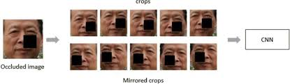

# Data Augmentation

## The algorithms Used

### Oclusion

Oclussion is the process of cropping/eliminating parts of an image for detection purposes. In this case using a random fraction of the image and turning that segment into

- Hyperparams:
  1. Width \*
